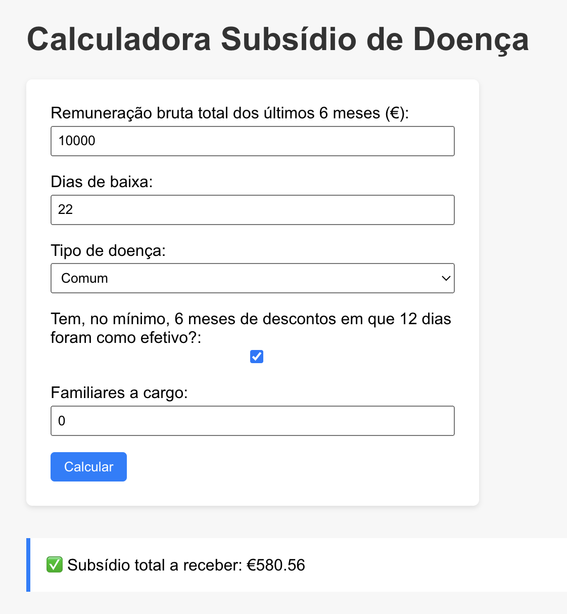

# Calculadora Subsídio de Doença 

Simulador que permite calcular o valor que um doente irá receber de subsídio de doença.

> A fórmula para calular o subsídio muda todos os anos, caso exista algum bug neste cálculo, podem criar um [Issue](https://github.com/PedroS11/calculadora-subsidio-doenca/issues) para ser atualizada.

A calculadora está disponível em https://calculadora-subsidio-de-doenca.web.app/

